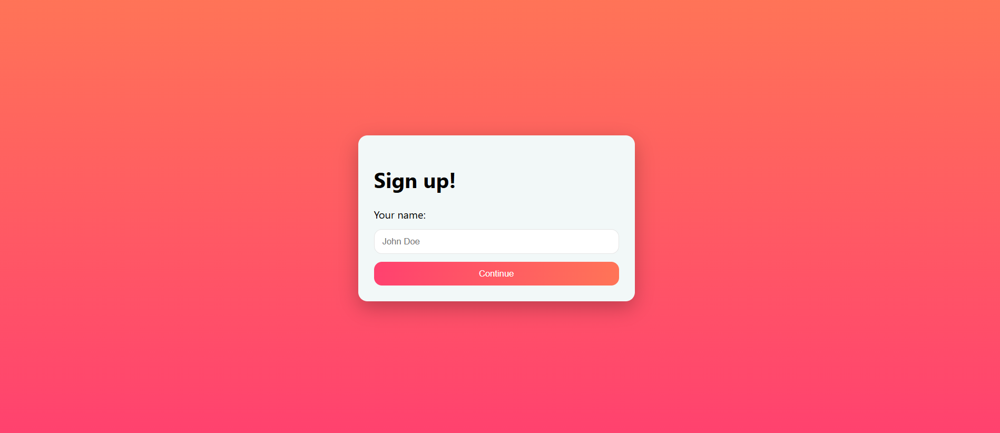
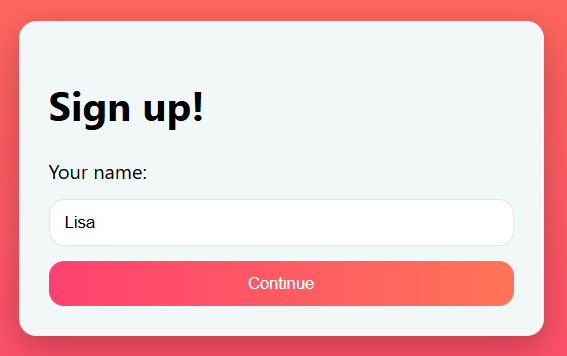
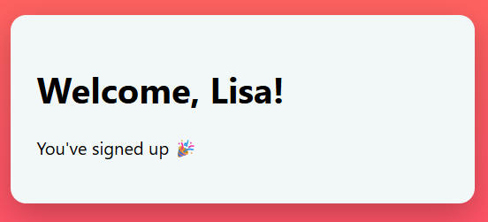
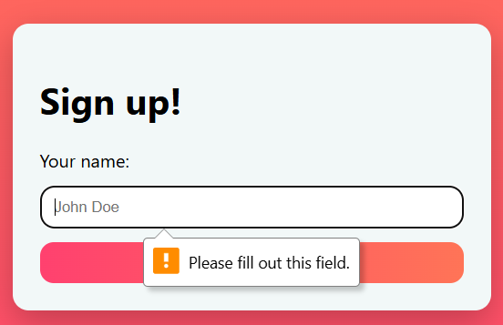

## Prompt: Sign Up

Create a sign up page, modal, form, or app screen related to signing up for something. It could be for a volunteer event, contest registration, a giveaway, or anything you can image.

## Application

A simple sign-up card with a name field and a ‘Continue’ button that shows a personalized ‘Thanks for signing up’ message.
Link to see code in action: https://codepen.io/nguyen-lisa/pen/VYvGYGB

## Screenshots

