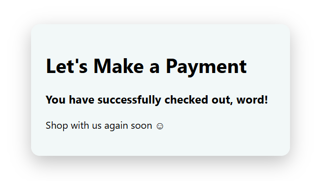
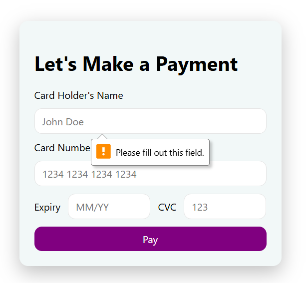

## Prompt: Credit Card Checkout

Design a credit card checkout form or page. Don't forget the important elements such as the numbers, dates, security numbers, etc.
I based the code off what I learnt from 001-signUp. The form input values take in any value.

Link to demo: https://codepen.io/nguyen-lisa/pen/vELYQpE

